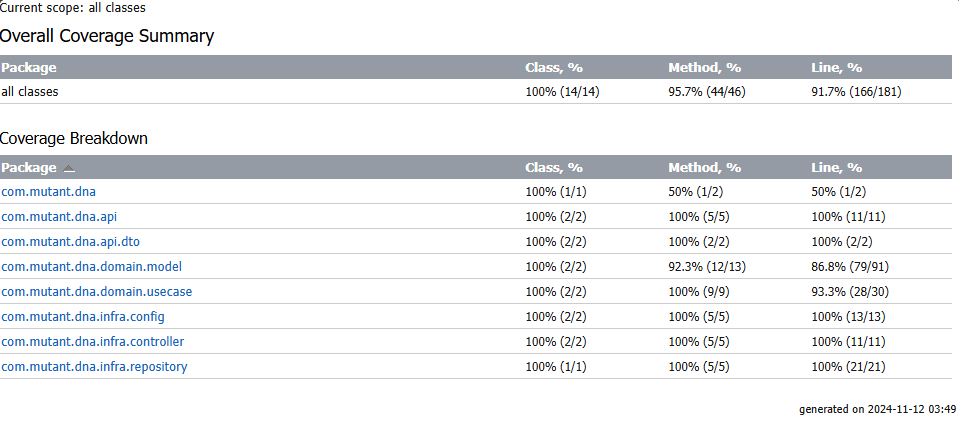

# API de Detección de ADN Mutante

Este proyecto es una aplicación de **Spring WebFlux** que determina si una secuencia de ADN pertenece a un mutante o a un humano. Utiliza **arquitectura hexagonal** para asegurar una clara separación entre la lógica de negocio, el dominio y las capas de infraestructura. La lógica de detección de mutantes reside en la **capa de dominio**, encapsulando la funcionalidad principal y aislándola de dependencias externas.

## Tabla de Contenidos
- [Descripción del Proyecto](#descripción-del-proyecto)
- [Probar Proyecto Desplegado](#probar-proyecto-desplegado)
- [Primeros Pasos](#primeros-pasos)
- [Requisitos Previos](#requisitos-previos)
- [Instalación](#instalación)
- [Pruebas](#pruebas)
- [Arquitectura](#arquitectura)
- [Autor](#autor)

## Descripción del Proyecto

La API consta de dos controladores principales:
- **DnaControllerCommand**: Recibe secuencias de ADN y determina si pertenecen a un mutante.
- **DnaControllerQuery**: Proporciona estadísticas sobre el número de secuencias de ADN mutante y humano procesadas.
- La funcion isMutant se encuentra en **"src/main/com/mutant/dna/domain/model/Mutant"**

## Probar Proyecto Desplegado

La API esta disponible a internet por tiempo limitado hasta 30 de noviembre del 2024.
Tener presente que los servicio montando se suspenden por inactividad, por lo tanto, mandar la peticion y esperar de 40s a 3 minutos al que servicio responda.
- **Url** https://dna-latest.onrender.com
- **Endpoints disponible** :
  - **/mutant/** : https://dna-latest.onrender.com/mutant/
    - **JSON**: 
      ```bash
        {
            "dna":[   
                "ATAAAA",
                "ATGTGT",
                "GTGACA",
                "ATATGT",
                "ACACTT",
                "AGATGG"
            ]
        }
  - **/stats** : https://dna-latest.onrender.com/stats

## Primeros Pasos

Para configurar una instancia local del proyecto, sigue los pasos a continuación.

### Requisitos Previos

- Java 11 o superior
- Maven o Gradle
- Docker (opcional, para configuración de base de datos)

### Instalación

1. Clona el repositorio:
   ```bash
   git clone https://github.com/EmanuelCasta/Meli-Test-GenAI-FFB-Team.git
- Descarga las dependencias del gradle y configurar bases de datos postgresql la cadena debe tener la siguiente forma
- main/java/resource/application.propierties colocar en las variables de entorno
  ```bash 
  spring.r2dbc.url=r2dbc:postgresql://<host>:<puerto_bases_de_datos>/<nombre_bases_de_datos>?sslMode=require
  spring.r2dbc.username=<nombre_usuario>
  spring.r2dbc.password=<tu_contraseña>
- Por ultimo usa tu entorno de desarrollo en este caso IJD


2. Puedes usar la magen de docker emanuelcasta/dna:latest
    ```bash
    docker run -p 3000:3000 -e SPRING_DATASOURCE_URL=r2dbc:postgresql://host.docker.internal:5433/<database> -e SPRING_DATASOURCE_USERNAME=postgres -e SPRING_DATASOURCE_PASSWORD=1234 emanuelcasta/dna


## Pruebas

Se realizo pruebas de integracion para obtener una cobertura de mas del 80%


## Arquitectura

Se realizo una arquitectura Hexagonal, donde isMutant se encuentra dentro del dominio y se la da uso con los casos de uso como deteccion de mutantes

## Autor

Este proyecto fue desarrollado por Emanuel Castañeda Cardona
- **Linkedin** https://www.linkedin.com/in/emanuel-casta%C3%B1eda-94201b231/


